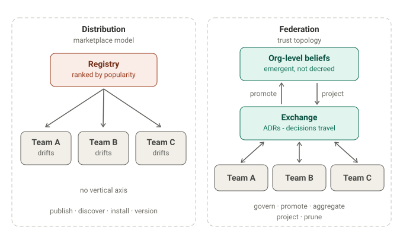
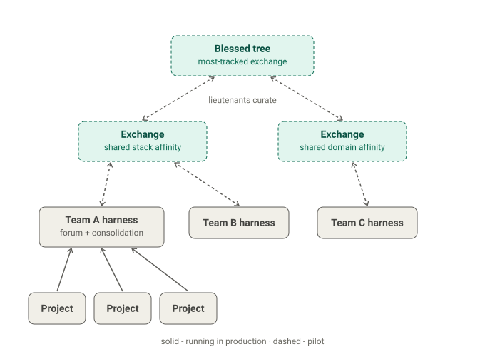

[Birgitta Böckelers Artikel über Harness Engineering](https://martinfowler.com/articles/harness-engineering.html) — die Praxis, ein Modell mit den Guides, Sensoren und Feedback-Loops zu umgeben, die daraus einen verlässlichen Coding-Agenten machen — lässt eine Frage bewusst offen. Harness-Templates, merkt sie an, könnten größeren Organisationen erlauben, gemeinsame Guides und Sensoren zu teilen — aber in dem Moment, in dem ein Team ein Template instanziiert, beginnt es, aus dem Takt zu geraten. Die Versionierungs- und Beitragsprobleme könnten *schlimmer* sein als bei klassischen Service-Templates, weil Guides und Sensoren keine deterministischen Artefakte sind. Sie benennt das Problem und geht weiter.

Der Rest des Feldes war damit beschäftigt, angrenzende Fragen zu beantworten. „Wie baue ich ein Harness für ein System" ist gut abgedeckt — [OpenAIs Bericht über eine vollständig agentenerstellte Codebasis](https://openai.com/index/harness-engineering/), Böckelers eigener Beitrag, ein wachsender Kanon praxisnaher Texte. „Wie komponiere, kontrolliere und teile ich Harnesses technisch" hat im Juni seine Antwort bekommen, als Databricks Omnigent als Open Source veröffentlichte, ein Meta-Harness, das Claude Code, Codex und eigene Agenten hinter einer API bündelt. Und „wie verpacke und verschicke ich Agent-Skills" reift schnell heran: Registries, `gh skill`, Provenienz und Pinning, Marketplace-Verzeichnisse mit tausenden Einträgen.

Letzte Woche hat die Plattform-Welt auch Böckelers offene Frage beantwortet. Port veröffentlichte einen Beitrag über Harness Engineering im großen Maßstab — zwanzig Teams, je zwanzig Agenten — mit der These, dass das Harness das Produkt des Plattform-Teams sei. Port hat diesen Beitrag inzwischen in [einen breiteren Erklärtext](https://www.port.io/blog/what-is-harness-engineering) integriert, aber die Antwort hat die Überarbeitung überlebt: auf Team- und Organisationsebene wird das Harness „zu einer Eigenschaft der Plattform, auf der alle bauen" — ein Context Lake, vorab freigegebene Integrationen, eine Agenten-Registry, Scorecards. Man mache die Plattform so gut, dass Teams *darauf bauen wollen*, und das Harness bildet sich darunter.

Ich halte diese Antwort für falsch — nicht schlecht umgesetzt, sondern die falsche *Kategorie*. Und weil es die Antwort ist, zu der die meisten Unternehmen greifen werden, lohnt es sich, genau zu sein, warum.

## Der falsche Standardweg

Wenn Harness Engineering in einer Organisation zu greifen beginnt — mehrere Teams, jedes mit einem eigenen, sich weiterentwickelnden Harness — stellt sich die Skalierungsfrage von selbst. Die instinktive Antwort ist die, auf die uns Platform Engineering seit einem Jahrzehnt trainiert hat: Golden Paths. Ein Plattform-Team kuratiert das kanonische Harness, veröffentlicht es als Template oder über einen internen Marktplatz, Teams übernehmen es. Distribution gelöst.

Das ist keine hypothetische Entwicklung. Am 30. Juni brachte Harness — das CI/CD-Unternehmen, dessen Name diesen Essay gleich schwerer lesbar macht — seinen Agent Marketplace zur allgemeinen Verfügbarkeit: verwaltete, zertifizierte und Community-Stufen, Policy-Governance, und auf jedem Agenten ein Fork-Button, mit dem Teams eingeladen werden, ihre eigenen Versionen zurück in den Katalog zu veröffentlichen. Ein Fork-Button ist Template-Drift mit besserer Ergonomie — die Divergenz, um die Böckeler sich sorgte, hat jetzt eine UI. Eine Woche später veröffentlichte Port seinen Beitrag. Der Standardweg bildet sich nicht erst; er ist bereits ausgeliefert.

Für Service-Templates funktioniert dieser Ansatz einigermaßen. Für Harness-Wissen scheitert er, aus drei konkreten Gründen.

Erstens ist Harness-Wissen **semantisch und kontextgebunden**. „Gib immer Result-Typen zurück" und „wirf Exceptions an der Grenze" können beide richtig sein — in unterschiedlichen Codebasen. Ein Sensor, der auf einen modularen Monolithen abgestimmt ist, schlägt bei einer Microservice-Flotte fehl. Was ein Muster funktionieren ließ, ist untrennbar davon, wo es funktioniert hat.

Zweitens **verfällt Harness-Wissen schneller als Code**. Muster kodieren Annahmen über *aktuelles* Modellverhalten. Eine alte Library kompiliert noch; ein altes Kontext-Management-Muster ist zwei Modellgenerationen später aktiv schädlich. Ein kuratierter Katalog ohne aggressives Gärtnern wird zum Friedhof mit gutem SEO.

Drittens — und das war der Punkt, den Port selbst früher einräumte — **werden Mandate umgangen**. Die ursprüngliche Version ihres Beitrags gab das direkt zu: Ein Harness kann nur die Agenten regieren, die tatsächlich darauf gebaut sind, also treibt ein Plattform-Mandat Entwickler:innen nur dazu, anderswo zu bauen, außerhalb der Governance. Der überarbeitete Erklärtext hat dieses Eingeständnis still gestrichen — organisationsweite Checkpoints werden jetzt als strukturell und nicht umgehbar dargestellt. Die ursprüngliche Fassung hatte recht: Harness-Adoption ist von Natur aus Pull-basiert. Eine Push-förmige Antwort um ein zentrales Produkt herum zu bauen, ändert daran nichts; das Eingeständnis stillschweigend zu löschen, auch nicht.

Templates driften, sagte Böckeler, und niemand trägt etwas ins Original zurück. Eine Registry behebt das nicht. Sie macht den Drift nur leichter zu installieren.

## Distribution ist nicht Federation

Hier ist die Kategorienunterscheidung, die der gesamten Debatte fehlt.

Ein Marktplatz — intern oder öffentlich — löst **Distribution**: veröffentlichen, entdecken, installieren, versionieren. Das sind reale Probleme, und Marktplätze lösen sie gut.

Harness-*Wissen* zu skalieren braucht **Federation**: regieren, befördern, aggregieren, projizieren, ausdünnen — über eine Topologie aus Vertrauen hinweg. Andere Verben, anderes Problem.

Drei Schnitte machen den Unterschied greifbar:

**Keine vertikale Achse.** Ein Marktplatz ist flach. Es gibt keinen Begriff dafür, dass ein Muster *befördert* wird — verallgemeinert vom Befund eines Teams zu einer domänen- oder organisationsweiten Überzeugung, weil es sich in mehreren Kontexten bewährt hat. „Unternehmensweit beliebt" ist nicht dasselbe wie „in den Org-Katalog befördert, weil es sich verallgemeinert hat und Evidenz aus N Teams trägt." Die gesamte Vertikale fehlt.

**Das falsche Ranking-Signal.** Marktplätze ranken nach Popularität — Installationen, Sterne, Qualitätsnoten. Federation rankt nach *Evidenz im Kontext*, gefiltert nach Anwendbarkeit. Zehntausend Installationen sagen nichts darüber aus, ob ein Muster zu deinem modularen Monolithen passt. Das ist das npm-Problem, verpflanzt: Distribution gelöst, Urteilsvermögen ungelöst.

**Install ist nicht Adoption.** Ein Marktplatz nimmt an, dass ein installiertes Artefakt auch sinnvoll genutzt wird. Ein Harness-Muster zu übernehmen bedeutet, es in den eigenen Kontext zu projizieren und Konflikte mit den bereits gehaltenen Überzeugungen aufzulösen — ein semantischer Merge. Für diese Operation hat ein Marktplatz überhaupt kein Konzept.

Der stärkste Beweis dafür, dass diese Lücke real ist, kommt von den Werkzeugen, die sie fast schließen. [netresearchs retro-skill](https://github.com/netresearch/retro-skill) ist das beste Prior Art, das ich kenne: Es analysiert eine Coding-Agent-Session, erkennt Reibung und leitet jeden Befund an eines von sechs Zielen weiter — Nutzer-Memory, Projekt-Regel, einen PR zurück ins Quell-Skill-Repo, einen neuen Skill und so weiter, jedes davon durch menschliche Freigabe abgesichert. Das ist Belief Routing, Fork-and-Pull und Maker/Checker — gebaut, im Einsatz, real. Und die eigene Spezifikation zieht die Grenze mit ungewöhnlicher Ehrlichkeit: organisationsübergreifende Beförderung, Aggregation über einen einzelnen Knoten hinaus, Merge- und Release-Koordination sind explizit außerhalb des Scopes.

Spiel das weiter. Jedes Team betreibt seine eigene, retro-skill-förmige Schleife, PRt unabhängig überlappende Befunde in N Skill-Repos — ohne Aggregation, ohne Deduplizierung, ohne teamübergreifende Entdeckung, ohne Evidenzgewichtung. Das ist *Federation-förmiges Chaos*. Die Bausteine liegen bereit. Niemand hat sie verbunden.

## Das Modell: ein verteiltes Harness

Das mentale Modell, das ich vorschlage, hat jede:r Entwickler:in bereits im Blut: **Behandle Harness-Wissen wie ein verteiltes Versionskontrollsystem.**

Kein zentrales Harness qua Mechanismus. Stattdessen beliebig viele Exchange-Repos, die sich entlang von Affinität bilden — gemeinsamer Stack, gemeinsame Domäne, oder einfach Leute, die gerne Notizen tauschen. Das Forum rund um einen Exchange ist nicht nur ein Ritual, es ist die *Definition* des Exchange: Seine Mitgliedschaft legt implizit den Anwendbarkeitsbereich fest, weil die Abstraktionsebene eines Exchange genau die ist, die über alle seine Knoten hinweg gilt. Jeder Knoten behält sein eigenes, vollständiges Harness. Wissen fließt **Pull-basiert** zwischen Knoten, die einander vertrauen. Reputation sammelt sich bei Knoten, deren Muster Evidenz tragen und übernommen werden; der „Org-Katalog" wird nicht verordnet, sondern ist, welchem Exchange die meisten Teams zufällig folgen — ein gesegneter Baum, emergent durch Vertrauensgravitation. Aggregation läuft über Lieutenants: Maintainer auf jeder Höhenebene, die kuratieren, was aufsteigt und was absteigt, so wie Kernel-Subsystem-Maintainer das tun.

Ein Einwand kommt sofort, und er verdient es, direkt adressiert zu werden: *diese Merges sind nicht mechanisch.* Zwei Konventionen können sich semantisch widersprechen; kein `git merge` löst „Result-Typen" versus „Exceptions". Richtig — und das ist kein Mangel der Analogie, sondern die Definition der Ebene. Wir arbeiten oberhalb von Code, dort, wo Menschen und Agenten aufeinandertreffen. Der Merge *ist* die Kuratierungsentscheidung. Und genau die Nicht-Mechanisierbarkeit dieses Merges ist der Grund, warum Marktplätze hier scheitern: Sie können nur Dinge ausliefern, die sich sauber installieren lassen.

Was die praktische Frage aufwirft: Wenn Artefakte nicht sauber übertragbar sind, was reist dann tatsächlich zwischen Knoten?

**Die Entscheidung reist, nicht das Artefakt.** Das Austauschmedium ist ein ADR. Die Schleife sieht so aus: Die Reflexionspraxis eines Teams — Session-Retros, ein `/reflect`-Kommando, ein retro-skill-artiger Agent — bringt eine Reibung und eine Lösung zutage. Im Team-Forum, meist bei der Retrospektive, wird dieser Befund zu einem ADR verdichtet, das die *Änderung am Harness* beschreibt: was geändert wurde (ein Guide, ein Sensor, ein Skill, ein AGENTS-Snippet), warum, mit welcher Evidenz und unter welchen Anwendbarkeitsbedingungen. Dieses ADR ist es, das auf den Exchange veröffentlicht wird.



Jeder andere Knoten kann daraufhin **seinen eigenen Harness-Diff aus dem ADR ableiten**. Die Projektion geschieht auf Empfängerseite, im Kontext des Empfängers, meist agentengestützt: Ein Discovery-Agent findet ADRs, die zu deinem Stack und deiner Topologie passen, ein lokaler Agent schlägt den konkreten Diff gegen *dein* Harness vor, ein Mensch kuratiert das Ergebnis. Übernehmen, anpassen oder verwerfen — festgehalten im eigenen ADR.

Diese empfängerseitige Schleife verdient einen Namen, und der ehrliche lautet **Adopt** — das Wort, auf das dieser Essay sich bereits gestützt hat. Eine Adoption endet auf eine von zwei Arten, und beide bilden sich sauber auf Versionskontrolle ab. Wenn die Entscheidung ohne lokale Änderung angewendet werden kann, ist es ein *Fast-Forward*. Muss sie angepasst werden, wird die Anpassung als **Trim** festgehalten — eine bewusste, dokumentierte Divergenz — und das Trim-ADR ist der Merge-Commit. Diese Unterscheidung beantwortet still die Drift-Sorge, mit der der ganze Essay begonnen hat: Sobald jede bewusste Divergenz als Trim dokumentiert ist, bekommt Drift eine präzise Definition — **undokumentierte Divergenz**. Ein Drift-Check hört auf, Rauschen zu sein („du weichst vom Upstream ab") und wird zu einem Befund („du weichst ab, und kein ADR sagt warum"). Jeder Knoten befindet sich gegenüber seinem Upstream in einem von drei Zuständen: fast-forwardbar, mit Trim gemerged, oder gedriftet.

Eine Eigenschaft des Austauschmediums leistet dabei stille, tragende Arbeit: **ADRs sind Append-only.** Eine veröffentlichte Entscheidung wird nie bearbeitet — sie wird durch eine neue Entscheidung ersetzt, die das ausdrückt. Das bedeutet, der Synchronisationsstand eines Knotens ist kein semantischer Dokumentenvergleich, sondern eine Mengendifferenz: Welche Upstream-Entscheidungen habe ich übernommen, angepasst oder abgelehnt — und welche sind neu. Die Adopt-Schleife konsumiert ein Log so, wie ein Service einen Event-Stream konsumiert, mit Supersession als kompensierendem Eintrag. Wikis und lebende Dokumente mutieren an Ort und Stelle und wälzen auf jeden Konsumenten die Aufgabe ab, Prosa zu diffen und zu erraten, was eine Änderung bedeutet hat; ein Append-only-Entscheidungslog ist das, was Ableitung überhaupt billig genug macht, um als Schleife zu laufen.

Bemerke, was das mit dem Marktplatz-Vergleich macht. Install-versus-Adoption hört auf, ein philosophischer Punkt zu sein, und wird mechanisch: Ein Marktplatz verschickt Artefakte; eine Federation verschickt Entscheidungen. Copy-Paste wird nicht nur entmutigt — es ist architektonisch unmöglich, weil jede Adoption zwangsläufig durch lokale Ableitung und Kuratierung geht. Das repariert auch die DVCS-Analogie an ihrer schwächsten Stelle: Das hier ist viel näher an einer Patch-Beschreibung auf der Kernel-Mailingliste als an einer Paket-Registry.

Um dieses Austauschmedium herum gruppieren sich die beweglichen Teile. **Loop-Agenten** halten das System am Leben: eine Konsolidierungsschleife, die Reflexionen in veröffentlichbare ADRs verwandelt, eine Aggregationsschleife, die Exchanges nach beförderungsreifen Mustern durchsucht und den Verallgemeinerungsentwurf für einen Lieutenant vorbereitet, ein Scout für die bedarfsgesteuerte Entdeckung, und ein Gärtner auf jedem Exchange, der verfallene Muster zur Neubestätigung oder zum Ausdünnen markiert.

**Ein Beförderungs-Gate** hält die Vertikale ehrlich: Eine Überzeugung steigt nur mit Evidenz auf, mit Adoption über mehrere Kontexte hinweg, und mit dem Nachweis, dass sie sich mindestens zweimal in konkrete Durchsetzung zurückprojizieren lässt — sonst ist sie zu „schreib guten Code" verdampft. Die Härtungsseite dieser Anforderung baut auf [Russ Miles' Progressive-Hardening-Leiter](https://github.com/Habitat-Thinking/ai-literacy-superpowers/blob/89199fec30e0e21d194cfaf9bf1f0029813e233c/ai-literacy-superpowers/skills/harness-engineering/SKILL.md) auf, ausgeführt in Buchlänge in [*The Sovereign Engineer*](https://leanpub.com/thesovereignengineer) — eine Deklaration erwirbt zunächst einen Agenten, der sie prüft, dann einen deterministischen Check, ohne dass es dem umgebenden System kümmern muss, was den Slot füllt. Und **Subsidiarität** regiert die Höhenebene: Überzeugungen leben so lokal wie möglich, so zentral wie nötig, wobei der Abstieg immer lokales Trimmen erlaubt.

Wenn sich das anhört wie Data Meshs föderierte, rechnergestützte Governance, angewandt auf Agent-Governance-Artefakte statt auf Datenprodukte — dann stimmt das, bewusst. Das intellektuelle Gerüst hier ist nicht neu: InnerSource für den sozialen Mechanismus, föderierte Governance für die Struktur, DVCS für die Topologie. Neu ist, sie auf Harness-Wissen zu richten.

Eine Anmerkung zur Evidenz, da ich mich darauf gestützt habe: Wir betreiben die unterste Sprosse dieses Modells produktiv in einem großen .NET-Programm mit modularem Monolithen — Projekt-Repos konsolidieren sich über ein Forum-Repo und einen Konsolidierungs-Agenten zu einem Team-Harness, mit ADR-gesteuerter Kuratierung. Alles darüber — der teamübergreifende Exchange, die Lieutenant-Höhenebenen — ist derselbe Mechanismus, rekursiv angewandt, aktuell auf dem Weg vom Design in den Pilotbetrieb. Ich veröffentliche, bevor die oberen Sprossen Kampfspuren haben, bewusst: Die Gegenerzählung verfestigt sich schneller, als meine Piloten laufen. Behandle die untere Sprosse als Existenzbeweis und die oberen Sprossen als Architektur mit offengelegten Annahmen.

## Auf dem Marktplatz aufbauen, ihn nicht ersetzen

Nichts davon spricht gegen Registries. Die Supply Chain — Packaging, Pinning, Provenienz, Discovery — ist das Substrat, auf dem Federation läuft, und ein interner Marktplatz ist ein durchaus guter Showroom. Das Argument ist, dass der Showroom nicht das Governance-Modell ist, und vier Ergänzungen machen aus einem beliebten Friedhof ein lebendes System:

Ein **Scout** statt Popularitäts-Ranking — Discovery gefiltert nach Anwendbarkeit und Evidenz, nicht nach Sternen; **Evidenz-im-Kontext als Währung** — was ein Muster bewiesen hat, wo, unter welchen Bedingungen; **Höhenebenen- und Lieutenant-Aggregation** — die fehlende Vertikale, damit Befunde als verallgemeinerte Überzeugungen aufsteigen und als Angebote absteigen können; und eine **Gärtner-Schleife** — Verfall als erstklassiges Anliegen behandelt, weil Harness-Muster schneller verrotten als alles andere im Regal.

Die Federation ist auch das, was den Output all der Pro-Knoten-Promote-Tools organisiert, die gerade ausgeliefert werden. retro-skill und seine Geschwister sind Knoten. Die Federation ist das, was viele Knoten kohärent macht.

## Was ehrlich kaputtgeht

**Lieutenants kosten Geld.** Der Linux-Kernel läuft auf Vollzeit-Maintainern und Jahrzehnten aufgebauten Vertrauens; Unternehmen haben beides nicht. Kuratierungszeit ist niemandes Job und niemandes Bonusziel. Die ehrliche Antwort: Mach die Lieutenant-Rolle zur natürlichen Heimat eines Enabling-Teams, halte den menschlichen Anteil strikt beim Urteilsvermögen (Agenten übernehmen das Scannen, die Deduplizierung und den Entwurf), und rotiere sie. Wenn eine Organisation überhaupt keine Kuratierung finanzieren will, rettet sie kein Modell — der Marktplatz-Friedhof ist dann schlicht die billigere Variante.

**Evidenz ist auch manipulierbar.** „Von N Teams übernommen, mit Evidenz" lässt sich genauso aufblasen wie Sterne. Es ist trotzdem ein besseres Signal, weil Anwendbarkeitsfilterung plus verpflichtende lokale Kuratierung bedeuten, dass ein manipuliertes Muster laut bei der Ableitung scheitert — aber ich werde nicht behaupten, das Messproblem sei gelöst.

**Cherry-Picking ist teuer.** In der Theorie kann ein Knoten ein einzelnes ADR übernehmen, so wie man einen Commit cherry-pickt. In der Praxis ist selektives Picking pro ADR der komplexeste Teil des Mechanismus, und kleine Topologien brauchen es nicht: Wenn der Drift-Check anschlägt, übernimmst oder trimmst du im Ganzen. Behandle Picks als Optimierung für große Federations, nicht als Day-One-Anforderung.

**Überabstraktion auf dem Weg nach oben** wird vom Rückprojektions-Gate aufgefangen; **Verfall** vom Gärtnern ab Tag eins, nicht als Phase-drei-Zusatz. Beides ist tragend, nicht nice-to-have.

## Das fehlende Bindeglied

Fünf Schichten der Harness-Welt werden gerade mit Tempo gebaut: einzelne System-Harnesses, technische Meta-Harnesses, die Artefakt-Supply-Chain, Top-down-Plattform-Distribution, Loop-Engineering. Die Schicht, die sie verbindet — wie Harness-*Erkenntnis* bottom-up über Teams und Höhenebenen fließt, durch Evidenz befördert, durch Vertrauen aggregiert, als Angebot zurückprojiziert — gehört noch keinem Produkt.

Die Forschung kreist von der Maschinenseite darum. [FederatedSkill](https://arxiv.org/abs/2606.03143), ein Paper vom Juni, föderiert Agent-Skill-Bibliotheken über Parteien hinweg, indem es semantische Skill-Patches über einen zentralen Evolutionsserver austauscht, Benchmark-Erfolg optimiert und dabei Privatsphäre wahrt. Das ist Federation von *Artefakten* per Mechanismus — keine Vertrauenstopologie, keine Evidenz-im-Kontext, kein menschliches Urteilsvermögen irgendwo in der Schleife. Es schärft den Punkt eher, als die Lücke zu schließen: Selbst die akademische Front ist damit beschäftigt, die Maschinenhälfte zu lösen.

Es ist InnerSource trifft föderierte, rechnergestützte Governance, getragen von Loop-Agenten. Die Maschinenseite des Harness-Skalierens wird immer wieder gelöst. Die menschliche Seite ist noch offen — und das Fenster, in dem „wir haben eine Registry installiert, Problem gelöst" zur gängigen Meinung erstarrt, schließt sich schnell.

Distribution ist nicht Federation. Bau beides.

---

*Changelog — dieser Essay wurde seit der Veröffentlichung überarbeitet:*

*2026-07-08 — Port hat seinen Beitrag über Skalierung in einen breiteren Erklärtext unter neuer URL integriert; Link und Zitat entsprechend aktualisiert, und die Passage zum Eingeständnis umgeschrieben, um zu vermerken, dass die Überarbeitung das ursprüngliche Zugeständnis gestrichen hat.*

*2026-07-09 — Die empfängerseitige Schleife **Adopt** benannt und ihre zwei Ausgänge ergänzt (Fast-Forward, Trim-Merge), zusammen mit der daraus folgenden Definition von Drift als undokumentierter Divergenz. Den Punkt „Forum definiert Anwendbarkeit" zum Modell hinzugefügt und den Cherry-Picking-Vorbehalt zu den Fehlermodi ergänzt. Die Beschreibung von Ports überarbeiteter Darstellung geschärft. Das statische ADR-Loop-Diagramm durch eine interaktive Simulation ersetzt.*

*2026-07-10 — v1.1: die Append-only-Eigenschaft des ADR-Austauschmediums ergänzt und Russ Miles' Progressive-Hardening-Leiter in der Passage zum Beförderungs-Gate gewürdigt, mit Verweisen auf sein Harness-Engineering-Skill-Repository und sein Buch **The Sovereign Engineer**.*
