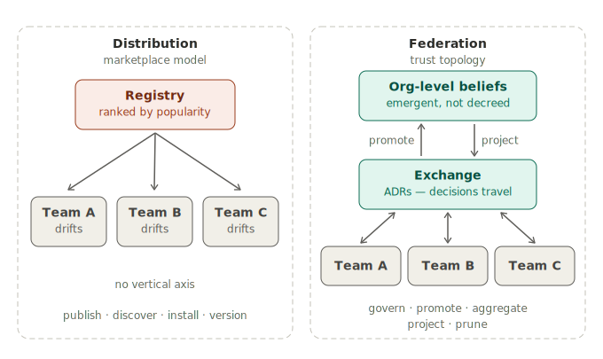
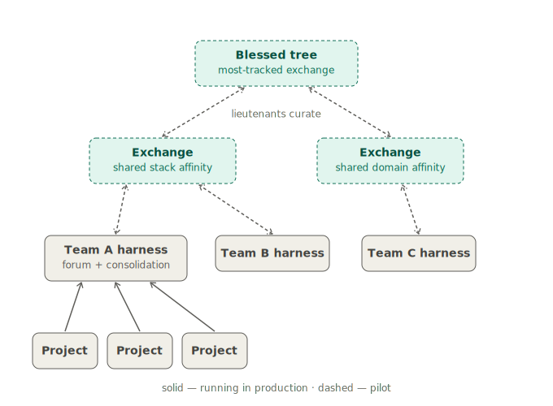
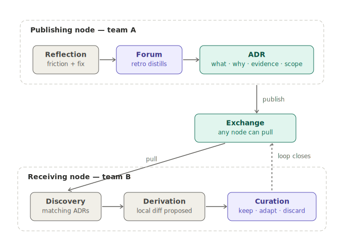

[Birgitta Böckeler's article on harness engineering](https://martinfowler.com/articles/harness-engineering.html) — the practice of wrapping a model in the guides, sensors, and feedback loops that make it a reliable coding agent — leaves one question deliberately open. Harness templates, she notes, could let larger organizations share common guides and sensors — but the moment a team instantiates a template, it starts drifting out of sync. The versioning and contribution problems might be *worse* than with classic service templates, because guides and sensors are not deterministic artifacts. She names the problem and moves on.

The rest of the field has been busy answering adjacent questions. "How do I build a harness for one system" is well covered — [OpenAI's account of a fully agent-built codebase](https://openai.com/index/harness-engineering/), Böckeler's own piece, a growing canon of practitioner writing. "How do I technically compose, control and share harnesses" got its answer in June, when Databricks open-sourced Omnigent, a meta-harness that wraps Claude Code, Codex and custom agents behind one API. And "how do I package and ship agent skills" is maturing fast: registries, `gh skill`, provenance and pinning, marketplace directories listing thousands of entries.

Last week, the platform world answered Böckeler's open question too. Port published a piece on harness engineering at scale — twenty teams, twenty agents each — arguing that the harness is the platform team's product. Port has since folded that piece into [a broader explainer](https://www.port.io/blog/what-is-harness-engineering), but the answer survived the edit: at the team and org level, the harness "becomes a property of the platform everyone builds on" — a context lake, pre-cleared integrations, an agent registry, scorecards. Make the platform so good that teams *want* to build on it, and the harness forms underneath them.

I think this answer is wrong — not badly executed, but the wrong *category*. And since it's the answer most enterprises will reach for, it's worth being precise about why.

## The wrong default

When harness engineering starts working in an organization — several teams, each with their own evolving harness — the scaling question arrives on its own. The instinctive answer is the one platform engineering has trained us on for a decade: golden paths. A platform team curates the canonical harness, publishes it as a template or through an internal marketplace, teams adopt it. Distribution solved.

This is not a hypothetical trajectory. On June 30th, Harness — the CI/CD company, whose name is about to make this essay harder to read — took its Agent Marketplace to general availability: managed, certified and community tiers, policy governance, and a fork button on every agent, with teams invited to publish their own back to the catalog. A fork button is template drift with better ergonomics — the divergence Böckeler worried about now has UI. A week later, Port published its piece. The default isn't forming; it has shipped.

For service templates, this approach works tolerably well. For harness knowledge, it fails, for three specific reasons.

First, harness knowledge is **semantic and context-bound**. "Always return Result types" and "throw exceptions at the boundary" can both be right — in different codebases. A sensor tuned for a modular monolith misfires on a microservice fleet. What made a pattern work is inseparable from where it worked.

Second, harness knowledge **decays faster than code**. Patterns encode assumptions about *current* model behavior. An old library still compiles; an old context-management pattern is actively harmful two model generations later. A curated catalog without aggressive gardening becomes a graveyard with good SEO.

Third — and this is the one Port itself used to admit — **mandates get routed around**. The original version of their piece conceded the point directly: a harness can only govern the agents actually built on it, so mandating the platform just pushes developers to build elsewhere, outside your governance. The revised explainer has quietly dropped that concession — org-level checkpoints are now framed as structural rather than optional. The original had it right: harness adoption is pull-based by nature. Architecting a push-shaped answer around a central product doesn't change that; deleting the admission doesn't either.

Templates drift, Böckeler said, and nobody contributes back upstream. A registry doesn't fix that. It makes the drift easier to install.

## Distribution is not federation

Here is the category distinction the whole debate is missing.

A marketplace — internal or public — solves **distribution**: publish, discover, install, version. These are real problems and marketplaces solve them well.

Scaling harness *knowledge* requires **federation**: govern, promote, aggregate, project, prune — across a topology of trust. Different verbs, different problem.

Three cuts make the difference concrete:

**No vertical axis.** A marketplace is flat. There is no notion of a pattern being *promoted* — generalized from one team's finding into a domain-level or org-level belief because it proved out in multiple contexts. "Popular company-wide" is not "promoted to the org catalog because it generalized and carries evidence from N teams." The entire vertical is missing.

**The wrong ranking signal.** Marketplaces rank by popularity — installs, stars, quality grades. Federation ranks by *evidence in context*, filtered by applicability. Ten thousand installs tell you nothing about whether a pattern fits your modular monolith. This is the npm problem transplanted: distribution solved, judgment unsolved.

**Install is not adoption.** A marketplace assumes that installing an artifact means using it meaningfully. Adopting a harness pattern means projecting it into your context and resolving conflicts with the beliefs you already hold — a semantic merge. A marketplace has no concept for that operation at all.

The strongest proof that this gap is real comes from the tools that almost close it. [netresearch's retro-skill](https://github.com/netresearch/retro-skill) is the best piece of prior art I know: it analyzes a coding-agent session, detects friction, and routes each finding to one of six destinations — user memory, project rule, a PR back to the source skill repo, a new skill, and so on, each gated by human approval. That is belief routing, fork-and-pull, and maker/checker — built, shipping, real. And its own spec draws the boundary with unusual honesty: cross-organization promotion, aggregation beyond a single node, merge and release coordination are explicitly out of scope.

Play that forward. Every team runs its own retro-skill-shaped loop, independently PRing overlapping findings into N skill repos — with no aggregation, no deduplication, no cross-team discovery, no evidence weighting. That is *federation-shaped chaos*. The primitives are on the shelf. Nobody has connected them.

## The model: a distributed harness

The mental model I'm proposing is one every developer already has in their bones: **treat harness knowledge like a distributed version control system.**

No central harness by mechanism. Instead, any number of exchange repos that form along affinity — shared stack, shared domain, or simply people who like trading notes. The forum around an exchange is not just a ritual, it is the exchange's *definition*: its membership implicitly sets the applicability scope, because the abstraction level of an exchange is whatever holds across all the nodes it tracks. Every node keeps its own complete harness. Knowledge flows **pull-based** between nodes that trust each other. Reputation accrues to nodes whose patterns carry evidence and get adopted; the "org catalog" is not decreed, it's whichever exchange most teams happen to track — a blessed tree, emergent through trust gravity. Aggregation runs through lieutenants: maintainers at each altitude who curate what rises and what descends, the way kernel subsystem maintainers do.

One objection arrives immediately, and it deserves to be met head-on: *these merges aren't mechanical.* Two conventions can contradict each other semantically; no `git merge` resolves "Result types" versus "exceptions." Correct — and that is not a defect of the analogy, it is the definition of the layer. We are working upstream of code, where humans and agents meet. The merge *is* the curation decision. And the non-mechanizability of that merge is precisely why marketplaces fail here: they can only ship things that install cleanly.

Which raises the practical question: if artifacts don't transfer cleanly, what actually travels between nodes?

**The decision travels, not the artifact.** The exchange medium is an ADR. The loop looks like this: a team's reflection practice — session retros, a `/reflect` command, a retro-skill-style agent — surfaces a friction and a fix. In the team forum, usually at the retrospective, that finding is distilled into an ADR that describes the *change to the harness*: what was changed (a guide, a sensor, a skill, an AGENTS snippet), why, with what evidence, and under what applicability conditions. That ADR is what gets published to the exchange.

Any other node can then **derive its own harness diff from the ADR**. The projection happens at the receiving end, in the receiver's context, typically agent-assisted: a discovery agent finds ADRs matching your stack and topology, a local agent proposes the concrete diff against *your* harness, a human curates the result. Keep, adapt, or discard — recorded in your own ADR.

This receiving-side loop deserves a name, and the honest one is **adopt** — the word this essay has already leaned on. An adoption ends in one of two ways, and both map cleanly back onto version control. If the decision applies without local modification, it is a *fast-forward*. If it needs adapting, the adaptation is recorded as a **trim** — a deliberate, documented divergence — and the trim ADR is the merge commit. That distinction quietly answers the drift worry the whole essay started from: once every deliberate divergence is documented as a trim, drift acquires a precise definition — **undocumented divergence**. A drift check stops being noise ("you differ from upstream") and becomes a finding ("you differ, and no ADR says why"). Every node sits in one of three states against its upstream: fast-forwardable, merged-with-trim, or drifted.

One property of the exchange medium does quiet, load-bearing work in all of this: **ADRs are append-only.** A published decision is never edited — it is superseded by a new one that says so. Which means a node's synchronization state is not a semantic comparison of documents but a set difference: which upstream decisions have I adopted, trimmed, or declined — and which are new. The adopt loop consumes a log the way a service consumes an event stream, with supersession as the compensating entry. Wikis and living documents mutate in place and push onto every consumer the job of diffing prose and guessing what an edit meant; an append-only decision log is what makes derivation cheap enough to run as a loop at all.

Notice what this does to the marketplace comparison. Install-versus-adoption stops being a philosophical point and becomes mechanical: a marketplace ships artifacts; a federation ships decisions. Copy-paste is not discouraged — it is architecturally impossible, because every adoption necessarily passes through local derivation and curation. It also repairs the DVCS analogy at its weakest joint: this is much closer to a patch description on the kernel mailing list than to a package registry.

Around that exchange medium sit the moving parts. **Loop agents** keep the system alive: a consolidation loop that turns reflections into publishable ADRs, an aggregation loop that scans exchanges for promotion-ready patterns and drafts the generalization for a lieutenant to judge, a scout for on-demand discovery, and a gardener on every exchange flagging decayed patterns for re-vouching or pruning.

**A promotion gate** keeps the vertical honest: a belief rises only with evidence, adoption across multiple contexts, and proof that it re-projects into concrete enforcement at least twice — otherwise it has evaporated into "write good code." The hardening side of that requirement builds on [Russell Miles' progressive-hardening ladder](https://github.com/Habitat-Thinking/ai-literacy-superpowers/blob/89199fec30e0e21d194cfaf9bf1f0029813e233c/ai-literacy-superpowers/skills/harness-engineering/SKILL.md) — a declaration acquires first an agent that reviews it, then a deterministic check, without the surrounding system caring which fills the slot. And **subsidiarity** governs altitude: beliefs live as locally as possible, as centrally as necessary, with descent always allowing local trim.

If this sounds like Data Mesh's federated computational governance applied to agent-governance artifacts instead of data products — it is, deliberately. The intellectual scaffolding here is not new: InnerSource for the social mechanism, federated governance for the structure, DVCS for the topology. What's new is pointing them at harness knowledge.

A note on evidence, since I've leaned on it: we run the lowest rung of this model in production on a large .NET modular-monolith program — project repos consolidating into a team harness through a forum repo and a consolidation agent, with ADR-gated curation. Everything above that rung — the cross-team exchange, the lieutenant altitudes — is the same mechanic applied recursively, currently moving from design into pilot. I'm publishing before the upper rungs have battle scars, deliberately: the counter-narrative is gelling faster than my pilots run. Treat the lower rung as an existence proof and the upper rungs as an architecture with its assumptions laid bare.

## Build on the marketplace, don't replace it

None of this argues against registries. The supply chain — packaging, pinning, provenance, discovery — is the substrate federation runs on, and an internal marketplace is a perfectly good showroom. The argument is that the showroom is not the governance model, and four additions turn a popular graveyard into a living system:

a **scout** instead of popularity ranking — discovery filtered by applicability and evidence, not stars; **evidence-in-context as the currency** — what a pattern proved, where, under which conditions; **altitude and lieutenant aggregation** — the missing vertical, so findings can rise as generalized beliefs and descend as offers; and a **gardener loop** — decay handled as a first-class concern, because harness patterns rot faster than anything else on the shelf.

The federation is also what organizes the output of all the per-node promote tools now shipping. retro-skill and its siblings are nodes. The federation is what makes many nodes coherent.

## What breaks, honestly

**Lieutenants cost money.** The Linux kernel runs on full-time maintainers and decades of accumulated trust; enterprises have neither. Curation time is nobody's job and nobody's bonus goal. The honest answer: make the lieutenant role the natural home of an enabling team, keep the human job strictly judgment (agents do the scanning, deduplication and drafting), and rotate it. If an organization won't fund any curation at all, no model saves it — the marketplace graveyard is then simply cheaper.

**Evidence is gameable too.** "Adopted by N teams with evidence" can be inflated just like stars. It's still a better signal, because applicability filtering plus mandatory local curation means a gamed pattern fails loudly at derivation time — but I won't pretend the measurement problem is solved.

**Cherry-picking is expensive.** In theory a node can adopt a single ADR the way you'd cherry-pick a commit. In practice, selective per-ADR picks are the most complex part of the mechanic to build, and small topologies don't need them: when the drift check fires, you adopt or trim wholesale. Treat picks as an optimization for large federations, not a day-one requirement.

**Over-abstraction on the way up** is caught by the re-projection gate; **decay** by gardening from day one, not as a phase-three add-on. Both are load-bearing, not nice-to-have.

## The missing link

Five layers of the harness world are getting built at speed: single-system harnesses, technical meta-harnesses, the artifact supply chain, top-down platform distribution, loop engineering. The layer that connects them — how harness *insight* flows bottom-up across teams and altitudes, promoted by evidence, aggregated through trust, projected back down as an offer — belongs to no product yet.

Research is circling it from the machine side. [FederatedSkill](https://arxiv.org/abs/2606.03143), a paper from June, federates agent skill libraries across parties by exchanging semantic skill patches through a central evolution server, optimizing benchmark success while preserving privacy. That is federation of *artifacts* by mechanism — no trust topology, no evidence-in-context, no human judgment anywhere in the loop. It sharpens the point rather than closing the gap: even the academic frontier is busy solving the machine half.

It is InnerSource meeting federated computational governance, carried by loop agents. The machine side of scaling harnesses keeps getting solved, again and again. The human side is still open — and the window in which "we installed a registry, problem solved" hardens into conventional wisdom is closing fast.

Distribution is not federation. Build both.

---

*Changelog — this essay has been revised since publication:*

*2026-07-08 — Port folded its at-scale piece into a broader explainer at a new URL; updated the link and quote accordingly, and rewrote the concession passage to note that the revision dropped the original admission.*

*2026-07-10 — v1.1: named the receiving-side loop (**adopt** — fast-forward or trim, drift redefined as undocumented divergence), defined an exchange's forum membership as its applicability scope, added the append-only property of the ADR exchange medium, added the cherry-picking caveat to "What breaks", and credited Russell Miles' progressive-hardening ladder in the promotion-gate passage.*
